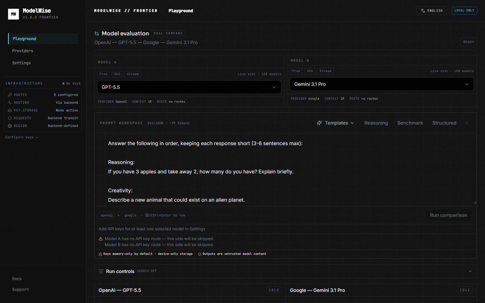
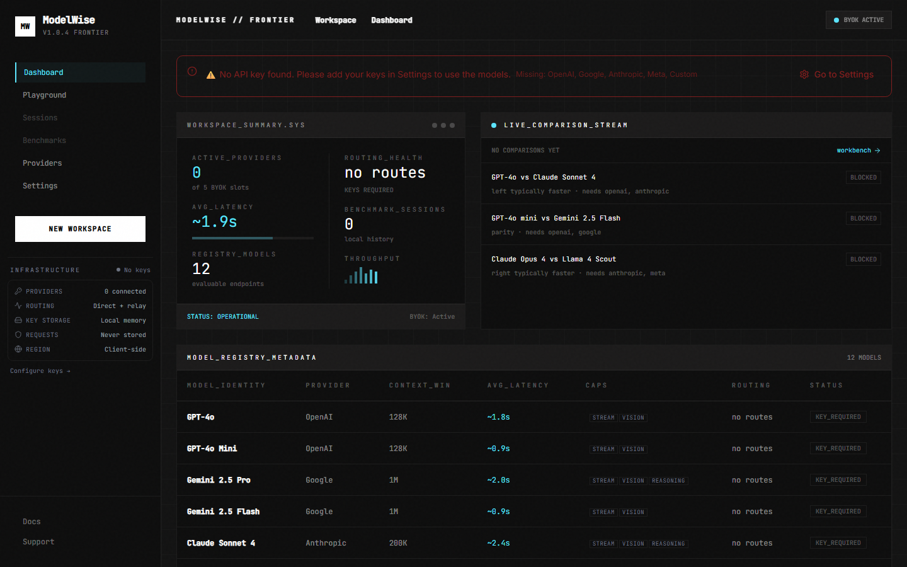
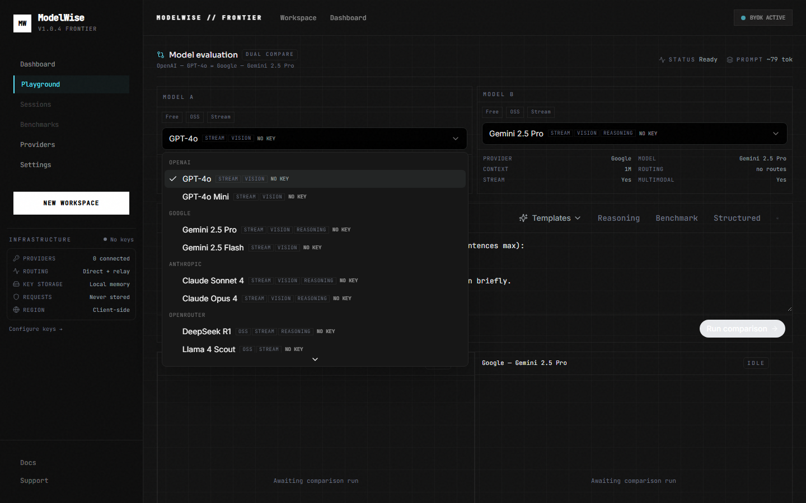
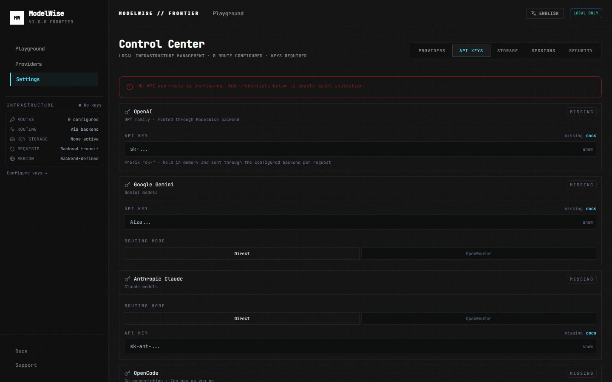

# ModelWise

**Open-source real-time frontier AI evaluation workbench.**

Compare two models side-by-side with live SSE streaming, divergence analysis, and BYOK provider routing — self-hosted, local-first, no hosted inference layer.

**Live demo:** [aicompare-nexus.vercel.app](https://aicompare-nexus.vercel.app) · **Repository:** [github.com/Archiixyz/aicompare-nexus](https://github.com/Archiixyz/aicompare-nexus)



---

## Privacy & security (BYOK)

- **Your API keys stay in the browser** — they are sent directly to the backend as request headers for compare/stream calls and are **never stored server-side**.
- **Sessions and preferences** are saved locally in IndexedDB unless you optionally enable Supabase cloud sync.
- **No account required** to compare models. Sign-in is optional and only for multi-device session backup.
- Details: [docs/PRIVACY.md](./docs/PRIVACY.md)

---

## Features

- **Real-time streaming compare** — dual-panel SSE token streaming via `POST /api/v1/stream`
- **Live divergence analysis** — debounced diff while tokens arrive
- **BYOK architecture** — API keys stay in your browser; backend forwards, never stores keys
- **OpenRouter support** — optional relay for OSS and frontier models
- **Dynamic model registry** — `GET /api/v1/models` with capability metadata
- **Local session persistence** — comparison history in browser storage
- **Self-hostable** — Vite + FastAPI, Docker optional
- **Multilingual UI** — English, French, Arabic (RTL)
- **Provider abstraction** — OpenAI, Google, Anthropic, OpenRouter relay, custom HTTP

---

## Supported Providers

| Provider | Streaming | Relay fallback | Vision | Notes |
|----------|-----------|----------------|--------|-------|
| **OpenAI** | Yes | OpenRouter | Yes | GPT-4o, GPT-4o Mini |
| **Google** | Yes | OpenRouter | Yes | Gemini 2.5 Pro / Flash |
| **Anthropic** | Yes | OpenRouter | Yes | Claude Sonnet 4, Opus 4 |
| **OpenRouter** | Yes | — | Varies | DeepSeek R1, Llama 4, Qwen 3, Gemma 3 |
| **Custom HTTP** | Yes | — | Varies | OpenAI-compatible endpoint |

Model list is dynamic — see [Model Registry](./docs/REGISTRY.md).

---

## Architecture

```
┌─────────────────────────────────────────────────────────────┐
│  Browser (React + Vite)                                     │
│  ┌──────────────┐  ┌──────────────┐  ┌──────────────────┐  │
│  │ Playground   │  │ Model        │  │ Session store    │  │
│  │ (SSE client) │  │ Registry     │  │ (localStorage)   │  │
│  └──────┬───────┘  └──────┬───────┘  └──────────────────┘  │
│         │ BYOK headers     │ GET /api/v1/models              │
└─────────┼──────────────────┼────────────────────────────────┘
          │                  │
          ▼                  ▼
┌─────────────────────────────────────────────────────────────┐
│  FastAPI backend (:8001)                                    │
│  routes/stream · routes/compare · routes/models             │
│  services/stream_service · registry_service                   │
│  providers/ (openai, google, anthropic, meta, custom)         │
└─────────┬───────────────────────────────────────────────────┘
          │
          ▼
   Provider APIs (OpenAI, Google, Anthropic, OpenRouter, …)
```

**Streaming flow:** Playground → `POST /api/v1/stream` → parallel provider streams → SSE events (`start`, `token`, `done`, `error`, `complete`) → UI batching via `requestAnimationFrame`.

**Provider routing:** Model ID + optional provider hint → `model_resolver` → direct key or OpenRouter relay slug.

Details: [docs/ARCHITECTURE.md](./docs/ARCHITECTURE.md) · [docs/STREAMING.md](./docs/STREAMING.md)

---

## Quick Start

### Prerequisites

- **Node.js** 18+
- **Python** 3.10+
- At least one provider API key (optional to browse UI; required to compare)

### 1. Clone & install

```bash
git clone https://github.com/Archiixyz/aicompare-nexus.git
cd aicompare-nexus

npm install

cd backend
pip install -r requirements.txt
cd ..
```

### 2. Environment (optional)

```bash
cp backend/env.env.example backend/env.env
# Edit backend/env.env — only needed for OpenRouter catalog merge or optional auth
```

### 3. Run

**Terminal 1 — backend**

```bash
cd backend
python -m uvicorn main:app --reload --host 127.0.0.1 --port 8001
```

**Terminal 2 — frontend**

```bash
npm run dev
```

Open **http://localhost:8080**

| Service | URL |
|---------|-----|
| Frontend | http://localhost:8080 |
| Backend API | http://127.0.0.1:8001 |
| API docs | http://127.0.0.1:8001/docs |

> Vite proxies `/api` and `/health` to port **8001** (see `vite.config.ts`).

### 4. Add API keys

1. Open **Settings → Providers**
2. Paste your keys (OpenAI, Google, Anthropic, and/or OpenRouter)
3. Go to **Playground** and run a compare

**Gemini quickstart:** Get a key at [Google AI Studio](https://aistudio.google.com/apikey), add under **Google**, select `Gemini 2.5 Flash` or `Gemini 2.5 Pro`.

**OpenRouter (optional):** Get a key at [openrouter.ai](https://openrouter.ai), add under **OpenRouter**. Enables OSS models and expands the registry when `OPENROUTER_API_KEY` is set on the backend.

---

## Environment Variables

### Backend (`backend/env.env`)

| Variable | Required | Description |
|----------|----------|-------------|
| `PORT` | No | Default `8001` |
| `CORS_ORIGINS` | No | Comma-separated frontend origins |
| `OPENROUTER_API_KEY` | No | Server-side OpenRouter catalog hydration |
| `SUPABASE_*` / `DATABASE_URL` | No | Optional auth stack (BYOK path works without) |

See [backend/env.env.example](./backend/env.env.example).

### Frontend

No `.env` required for local dev — Vite proxies API calls.

For production (Vercel + Railway split deploy), set:

| Variable | Description |
|----------|-------------|
| `VITE_API_URL` | Public Railway backend URL (no trailing slash) |
| `VITE_SUPABASE_URL` | Optional — cloud sync |
| `VITE_SUPABASE_ANON_KEY` | Optional — cloud sync |

See [DEPLOY.md](./DEPLOY.md) and [docs/SELF_HOSTING.md](./docs/SELF_HOSTING.md).

---

## Streaming

ModelWise streams both model responses over a single SSE connection.

```http
POST /api/v1/stream
X-OpenAI-API-Key: sk-...
X-Google-API-Key: AIza...

{"prompt":"...","leftModel":"gpt-4o","rightModel":"gemini-2.5-flash"}
```

Events: `start` → `token`* → `done` | `error` → `complete`

Full contract: [docs/STREAMING.md](./docs/STREAMING.md)

---

## Model Registry

The UI hydrates models from **`GET /api/v1/models`** — not hardcoded dropdowns.

Each model exposes: streaming, context window, vision, reasoning, OSS, free-tier, and relay metadata. Optional OpenRouter merge when a key is configured.

Details: [docs/REGISTRY.md](./docs/REGISTRY.md)

---

## Screenshots

| Playground (streaming) | Dashboard |
|------------------------|-----------|
|  |  |

| Model registry | Settings |
|----------------|----------|
|  |  |

---

## Docker (optional)

```bash
docker compose up --build
```

Frontend: http://localhost:8080 · Backend: http://localhost:8001

See [docs/SELF_HOSTING.md](./docs/SELF_HOSTING.md) and [DOCKER.md](./DOCKER.md).

---

## Documentation

Optional cloud sync: sign in with GitHub or Google to backup sessions and prompts across devices. **Fully optional** — see [docs/CLOUD_SYNC.md](./docs/CLOUD_SYNC.md).

| Doc | Topic |
|-----|-------|
| [DEPLOY.md](./DEPLOY.md) | Vercel + Railway production deploy |
| [PRIVACY.md](./docs/PRIVACY.md) | BYOK, local data, optional sync |
| [CLOUD_SYNC.md](./docs/CLOUD_SYNC.md) | Optional Supabase identity + sync |
| [ARCHITECTURE.md](./docs/ARCHITECTURE.md) | System design |
| [STREAMING.md](./docs/STREAMING.md) | SSE contract |
| [REGISTRY.md](./docs/REGISTRY.md) | Model catalog |
| [PROVIDERS.md](./docs/PROVIDERS.md) | BYOK & routing |
| [SELF_HOSTING.md](./docs/SELF_HOSTING.md) | Deploy guide |
| [CONTRIBUTING.md](./CONTRIBUTING.md) | Dev & PR guide |

---

## Roadmap

Realistic next steps (not committed):

- Live provider health probes on dashboard
- Registry `lastVerified` timestamps
- Cost estimates from registry pricing metadata
- Dedicated benchmarks workspace

Out of scope: hosted inference, billing, teams, agents.

---

## Philosophy

- **Local-first** — keys and sessions stay on your machine
- **BYOK** — you pay providers directly; ModelWise adds no inference markup
- **No hosted inference layer** — we route; we don't run models
- **No data collection** — no telemetry, no key storage server-side
- **Focused tool** — evaluation workbench, not an agent platform or SaaS

---

## License

MIT — see [LICENSE](./LICENSE).
