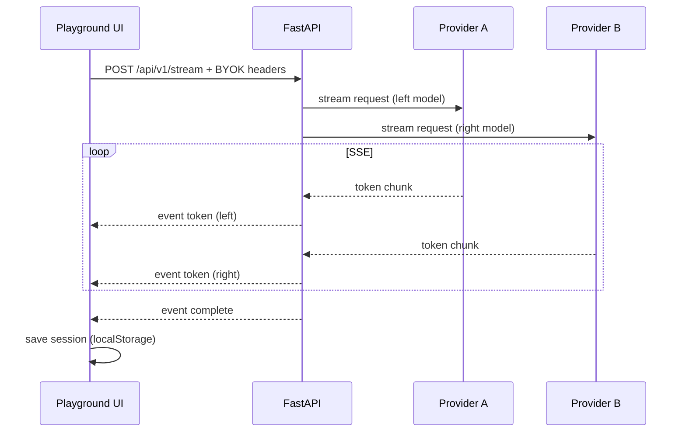

# Architecture

ModelWise is a **local-first BYOK evaluation workbench**: React frontend + FastAPI backend that routes requests to third-party AI APIs.

## Repository layout

```
modelwise/
├── src/                    # React frontend (Vite)
│   ├── components/         # UI (playground, dashboard, settings)
│   ├── lib/                # compare-stream, model-registry, session-store
│   ├── hooks/              # use-model-registry, use-stream-diff
│   └── config/providers.ts # BYOK branding + relay config (no model lists)
├── backend/
│   ├── main.py             # App entry — mounts routers only
│   ├── routes/             # compare, stream, models, health, auth
│   ├── services/           # compare_service, stream_service, registry_service
│   ├── providers/          # openai, google, anthropic, meta, custom
│   ├── registry/           # Frontier model catalog
│   └── utils/              # BYOK headers, model_resolver
└── docs/                   # Architecture, streaming, registry, providers
```

> **Note:** The top-level `app/` directory is a **deprecated** legacy backend. Use `backend/` only.

## Request paths

### Compare (non-streaming)

```
Browser ──POST /api/v1/ask──► FastAPI ──► providers/* ──► OpenAI / Google / …
         BYOK headers in request
```

### Streaming compare (primary UX)

```
Browser ──POST /api/v1/stream──► stream_service
                                      ├── provider A (async generator)
                                      └── provider B (async generator)
                                 SSE multiplex ──► Browser
```

### Model registry

```
Browser ──GET /api/v1/models──► registry_service
                                    ├── FRONTIER_CATALOG (static)
                                    └── optional OpenRouter merge
```

## Frontend modules

| Module | Role |
|--------|------|
| `PromptPlayground` | Orchestrates compare, abort, session save |
| `consumeCompareStream` | SSE reader + event dispatch |
| `buildCompareHeaders` | Maps BYOK keys to `X-*-API-Key` headers |
| `useModelRegistry` | Cached registry hydration + filters |
| `session-store` | localStorage comparison history |

## Backend modules

| Module | Role |
|--------|------|
| `model_resolver` | Infer provider from model ID; map relay slugs |
| `ByokHeaders` | Parse incoming key headers |
| `registry/catalog.py` | Single source of frontier model metadata |
| `providers/factory.py` | Instantiate provider adapter |

## Security model

1. **Keys never persisted server-side** — passed per-request in headers
2. **Keys stored in browser** — `secure-api-keys` (localStorage, profile-scoped)
3. **Backend is a forwarder** — no centralized billing or inference
4. **CORS restricted** — dev origins in `CORS_ORIGINS`

## Data flow diagram



## Extension points

- **New provider:** add adapter under `backend/providers/`, register in factory, add `PROVIDER_CONFIG` entry in frontend
- **New model:** add to `backend/registry/catalog.py` + relay map if needed
- **New capability badge:** extend registry schema + `getModelCapabilities()`

See [CONTRIBUTING.md](../CONTRIBUTING.md).
